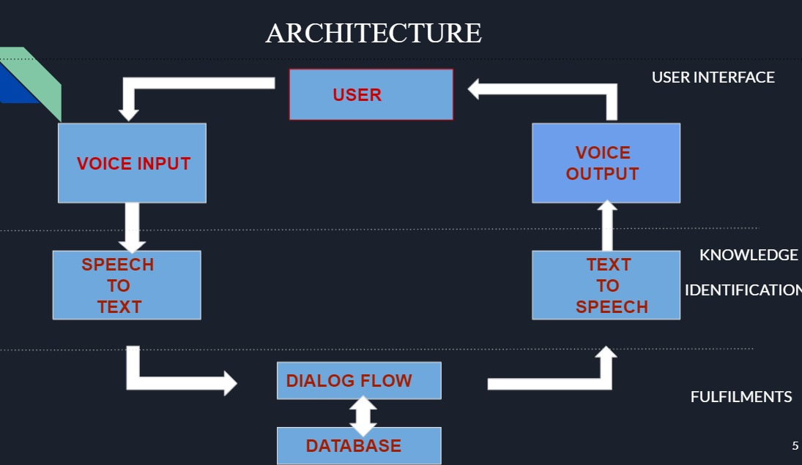

**RAILWAY CHATBOT FOR VISUALLY IMPAIRED PEOPLE** 
The chatbot will enable differently abled persons to do railway enquiries. 

**CONTRIBUTORS**: 

 1.Thejalekshmi B S 
 2.Sosa Thomas 
 3.Gowri Chandran S 
 4.Dency P Daniel 
 5.Arya M.S 
 
**COLLEGE**: LBS INSTITUTE OF TECHNOLOGY FOR WOMEN, TRIVANDRUM 

**PROBLEM STATEMENT**: 

      * No adequate facility  for  providing better experience and ease of access to visually impired people. 
      * User Experience is critical for the success and failure of a product. 
      * Accessibility is one  of the important factor in user experience  where we should consider  providing  experience  to differently abled users  also. 
      
 **PERSONA**: Visually Impaired People 
 
 **ARCHITECTURE:** 
 
     

